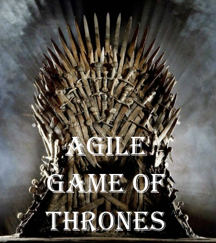

# Atelier Agile Game of Thrones

Agile Game of Thrones est un atelier de sensibilisation à l'agilité.
Il est aussi appelé le jeu des armures.

## Objectif

L'enjeu de l'atelier est d'illustrer l'intérêt d'un algorithme de priorisation, en l'occurrence le ROI (retour sur investissement) qui vise à maximiser la valeur métier (VM) tout en minimisant le coût (C) des éléments du backlog.

## Format

À ce jour il existe trois formats différents qui implémentent cet atelier :
 * format long au thème [Game of Thrones](long_version_got) ;
 * format long au thème [Kaamelott](long_version_kaamelott) ;
 * [format court](short_version) sans thème.

---
## Débrief possible

Un bon débrief provient en général des participants eux-mêmes.
N'hésitez pas à poser des questions pour les faire réagir, et à prendre le temps nécessaire pour bien échanger.
Sinon l'atelier ne sert à rien.

En général, on veut évoquer les points suivants.

### Comment maximiser la valeur livrée ?

En utilisant un algorithme intuitif (ROI), on arrive souvent à livrer 75 % de notre valeur totale en 50 % du temps.
Avec la version Game of Thrones, aucun algorithme n'est imposé mais celui-ci est naturellement choisi par les équipes.  
Réfléchir à la question : pourquoi dépenser encore beaucoup de temps pour faire ce qui a moins de valeur ?

### Comment prioriser ?

On peut prioriser par un algorithme (ROI, WSJF...) mais l'ordre final du backlog à un instant t peut encore être différent.
En effet, on prend en compte la valeur, le coût mais également d'autres paramètres (événement ponctuel, valeur qui décroît avec le temps, etc.).

### Comment utiliser le ROI en entreprise ?

On a l'habitude d'estimer l'effort pour réaliser nos tâches.
Mais comment estimer la valeur apportée une fois livrée ?
Faire parler les expériences de chacun.

### Comment découper nos incréments de valeur pour pouvoir les estimer au bon moment ?

Quelle granularité ?
Faire de la macro-estimation (valeur et coût) ?
Qui estime ?

### Comment gérer les changements de priorité ?

Comment accepter le changement, même tard dans le projet ?
Comment limiter les risques ?
Pourquoi parle-t-on de cycle priorisé itératif ?

---
## Licence

Agile Game of Thrones de Mael Morel et Romain Schlick est mis à disposition selon les termes de la licence [Creative Commons](https://creativecommons.org/licenses/by-nc-sa/4.0/) - Pas d’Utilisation Commerciale - Partage dans les Mêmes Conditions International 4.0 (CC BY-NC-SA 4.0). "Game of Thrones" est une série déposée par HBO (Home Box Office Inc.). Cet atelier pédagogique n'utilise pas l'image de "Game of Thrones" à des fins commerciales.

## Contributeurs ✨

Un grand merci à nos généreux contributeurs ([liste des icônes](https://allcontributors.org/docs/en/emoji-key)) :

<!-- ALL-CONTRIBUTORS-LIST:START - Do not remove or modify this section -->
<!-- prettier-ignore -->
<table>
  <tr>
    <td align="center"><a href="https://github.com/mael-morel"> <b>mael-morel</b></a> <a href="https://github.com/Zenigata/agilegameofthrones/commits?author=mael-morel" title="Documentation">📖</a></td>
    <td align="center"><a href="https://github.com/Zenigata"> <b>Johan Bonneau</b></a> <a href="https://github.com/Zenigata/agilegameofthrones/commits?author=Zenigata" title="Documentation">📖</a></td>
    <td align="center"><a href="https://github.com/benjaminfontaine"> <b>benjamin fontaine</b></a> <a href="https://github.com/Zenigata/agilegameofthrones/commits?author=benjaminfontaine" title="Documentation">📖</a></td>
    <td align="center"><a href="https://github.com/rschlick"> <b>rschlick</b></a> <a href="https://github.com/Zenigata/agilegameofthrones/commits?author=rschlick" title="Documentation">📖</a></td>
    <td align="center"><a href="https://github.com/Guenever"> <b>guenever</b></a> <a href="https://github.com/Zenigata/agilegameofthrones/commits?author=guenever" title="Documentation">📖</a></td>
  </tr>
</table>

<!-- ALL-CONTRIBUTORS-LIST:END -->

Ce dépôt utilise l'excellent outil [all-contributors](https://github.com/all-contributors/all-contributors).
Participez vous aussi !